# Séances 1 et 2 : La création de processus lourds

## Exercice 1

1) On affiche l'arbre des processus à l'aide de la commande ``pstree``, pour afficher les PID des différents processus, on ajoute l'option ``-p``. Le processus racine du sytème est nommé ``systemd`` et a pour PID 1.
   
   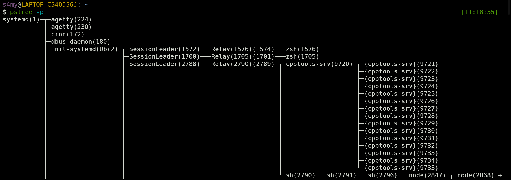
2) On trouve le pid_shell à l'aide de la commande ``echo $$``
3) On trouve bien une feuille avec pour PID pid_shell
4) On affiche le sous-arbre enraciné en pid_shell à l'aide de la commande ``pstree ${pid_shell}``.
5) On compile le programme à l'aide de la commande ``gcc -Wall -o concurrence concurrence.c``
6) En exécutant le  fichier on remarque bien qu'un nouveau processus est apparu dans le pstree, on remarque également qu'il est le fils du processus du terminal dans lequel nous l'avons lancé et il disparrait bien de l'arborescence lorsque l'exécution est finie.
7) Lorsque l'exécution est terminée, le processus lié à l'exécution de Shell 1 n'a plus de fils.
8) On lance deux fois l'exécutable à l'aide de la commande ``./concurrence & ./concurrence``. On constate que deux processus sont créer dans l'arborescence, ils ont tous deux Shell 1 comme père.
9)  Même chose, mais cette fois Shell 1 a trois fils identiques.
    
    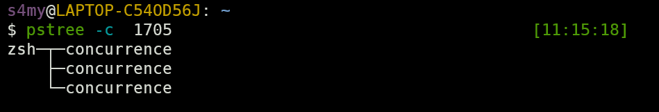
10) On retrouve bien à l'aide de la commande ``ps j`` les deux processus liés à concurrence et d'après la colonne STAT, ils sont tous les deux endormis (S) (on constate par ailleurs que ps est en R)
    
    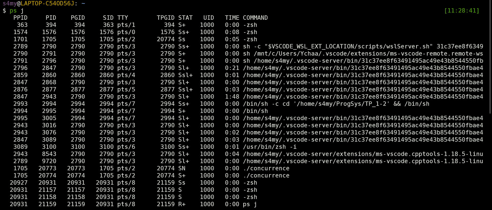
11) On constate en effet que l'ordonnancement mis en oeuvre par le noyau système n'est pas prévisible de notre point de vue
    
    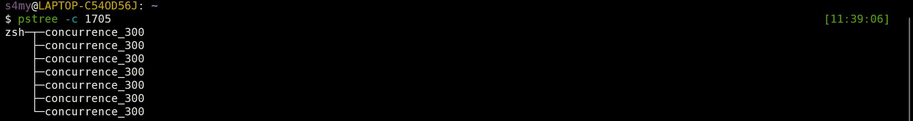
    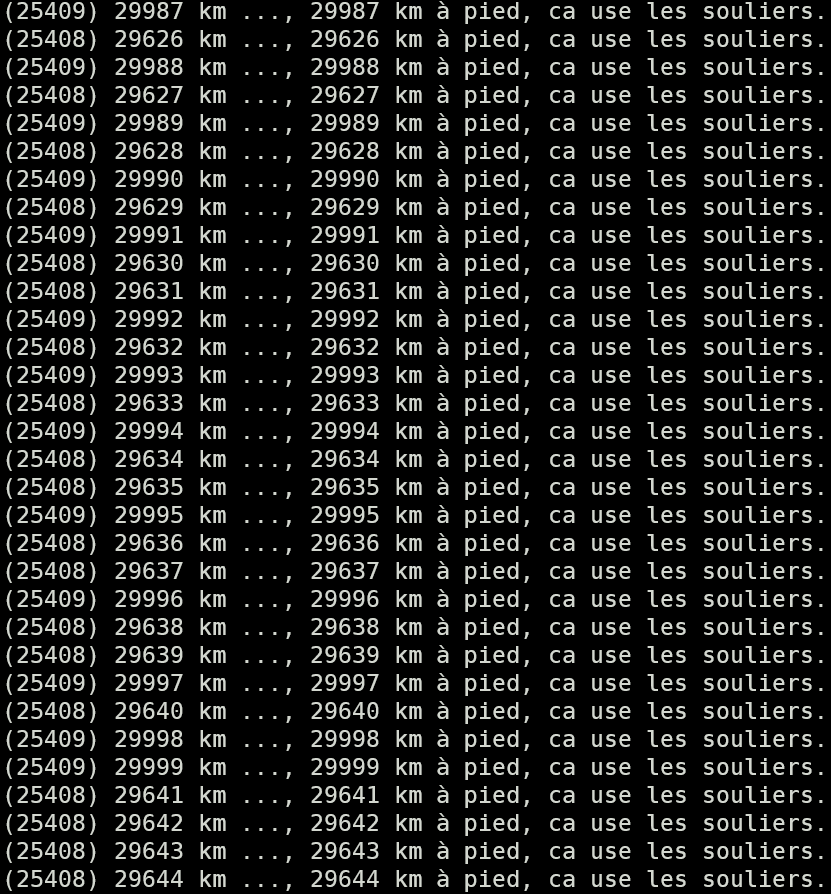

## Exercice 2

Ma machine comporte 8 coeurs, on observe la consommation processeur à l'aide de htop. On constate que la mobilisation des coeurs est différentes pour plusieurs exécutions.

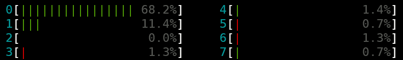
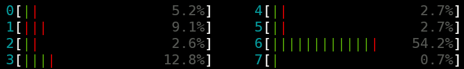
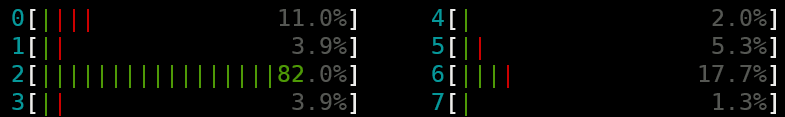

## Exercice 3

On cherche la commande fork dans le manuel à l'aide de la commande ``man fork``.

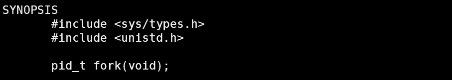
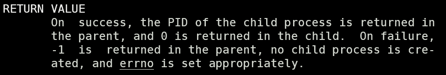

## Exercice 4

1) La primitive fork peut échouer si jamais la limite de threads autorisée a été atteinte : la table des PCB est pleine et on peut plus générer un nouveau PID ou si l'allocation mémoire a échouée à cause d'une mémoire trop étroite.
2) Après exécution on obtient l'arbre suivant :
   
   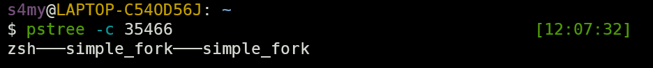
3) Ne pouvant pas prédire à l'avance le comportement de l'ordonnanceur du système, on ne peut pas savoir à l'avance si c'est le fils ou le père qui va se terminer en premier.
4) On modifie le code en ajoutant la ligne :
   ```C
   printf("My father's PID is : (%d) \n", getppid());
   ```
5) On obtient ainsi en sortie :  

   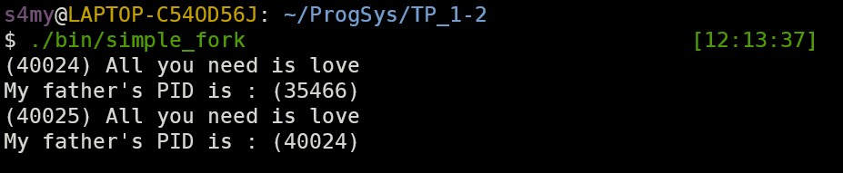
6) On a donc l'arbre suivant :
   
   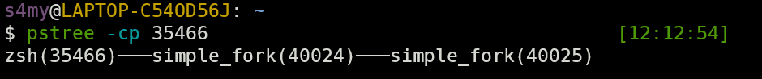
7) On peut relancer l'exécution et on remarque que le processus lié à l'exécution du terminal n'a pas changé de PID (c'est normal, il est toujours en cours d'exécution) et que les PID des deux processus liés à l'exécution du fichier simple_fork sont nouveaux.
   
   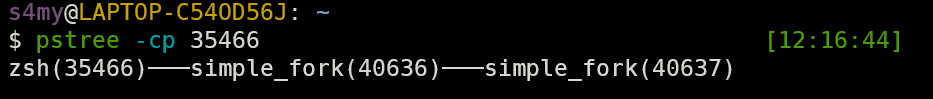
8) Les processus ont bien disparus à l'issue de l'exécution du programme : le pstree enraciné en Shell 1 n'a plus de fils.

## Exercice 5
### appel_fork1
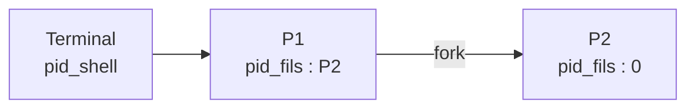
On retrouve bien en sortie :
```
(P1) Sing it’
(P1) We will we will rock you (P2)
(P2) We will we will rock you (0)
```
### appel_fork2

Sortie:
```
(P1) We can light it up, up, up
(P2) So they can’t put it out, out, out
```
### appel_fork3
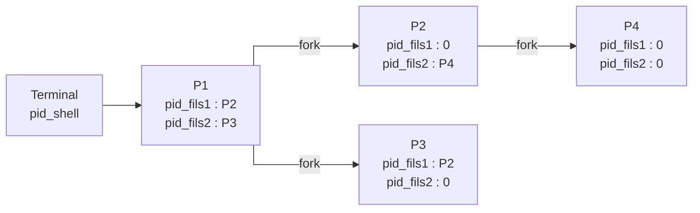
Sortie:
```
(P1) Do you do you Saint-Tropez (P2) (P3)
(P3) Do you do you Saint-Tropez (P2) (0)
(P2) Do you do you Saint-Tropez (0) (P4)
(P4) Do you do you Saint-Tropez (0) (0)

zsh(pid_shell)───appel_fork3(P1)─┬─appel_fork3(P2)───appel_fork3(P4)
                                 └─appel_fork3(P3)
```
### appel_fork4
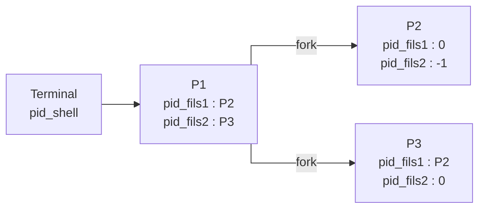
Sortie :
```
Bonjour, je suis Léodagan (P1).
Bonjour, je suis Guenièvre (P2), mon père est P1.
Bonjour, je suis Yvain (P3), mon père est P1.

zsh(pid_shell)───appel_fork4(P1)─┬─appel_fork4(P2)
                                 └─appel_fork4(P3)
```
### appel_fork5
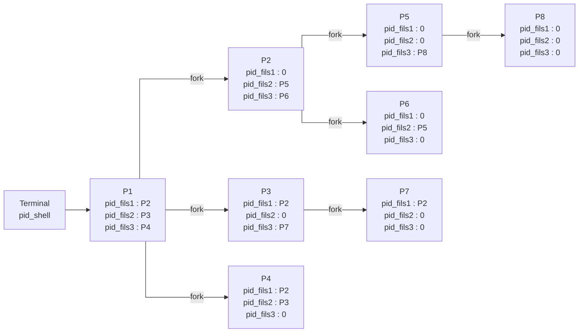
Sortie :
```
(P1) Alors on danse (P2) (P3) (P4)
(P4) Alors on danse (P2) (P3) (0)
(P2) Alors on danse (0) (P5) (P6)
(P3) Alors on danse (P2) (0) (P7)
(P5) Alors on danse (0) (0) (P8)
(P6) Alors on danse (0) (P5) (0)
(P7) Alors on danse (P2) (0) (0)
(P8) Alors on danse (0) (0) (0)

zsh(pid_shell)───appel_fork5(P1)─┬─appel_fork5(P2)─┬─appel_fork5(P5)───appel_fork5(P8)
                                 │                 └─appel_fork5(P6)
                                 ├─appel_fork5(P3)───appel_fork5(P7)
                                 └─appel_fork5(P4)
```

## Exercice 6

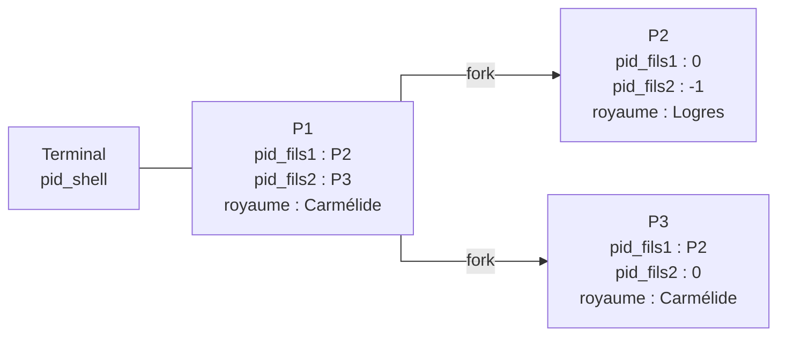
Sortie :
```
(Léodagan, PID : P1, PPID : pid_shell) voici mon royaume : Carmélide.
(Guenièvre, PID : P2, PPID : P1) voici mon royaume : Carmélide.
(Guenièvre, PID : P2, PPID : P1) voici mon nouveau royaume : Logres.
(Yvain, PID : P3, PPID : P1) voici mon royaume : Carmélide.

zsh(pid_shell)───royaume(P1)─┬─royaume(P2)
                             └─royaume(P3)
```

## Exercice 7

### Affichage 1
```
Père − 1 Frère Jacques, Frère Jacques
Père − 1 Dormez−vous ? Dormez−vous ?
Fils − 2 Frère Jacques, Frère Jacques
Père − 1 Sonnez les matines ! Sonnez les matines !
Fils − 2 Dormez−vous ? Dormez−vous ?
Père − 1 Ding, daing, dong, Ding, daing, dong ...
Fils − 2 Sonnez les matines ! Sonnez les matines !
Fils − 2 Ding, daing, dong, Ding, daing, dong ...
```
Affichage possible.
### Affichage 2
```
Père − 1 Frère Jacques, Frère Jacques
Père − 1 Dormez−vous ? Dormez−vous ?
Fils − 2 Frère Jacques, Frère Jacques
Père − 2 Sonnez les matines ! Sonnez les matines !
Fils − 2 Dormez−vous ? Dormez−vous ?
Père − 2 Ding, daing, dong, Ding, daing, dong ...
Fils − 2 Sonnez les matines ! Sonnez les matines !
Fils − 2 Ding, daing, dong, Ding, daing, dong ...
```
Affichage impossible car la valeur de i est égale à 1 pour le père, en effet, i est incrémenté seulement si pid_fils est égal à 0 i.e. seulement pour le fils.
### Affichage 3
```
Père − 1 Frère Jacques, Frère Jacques
Fils − 2 Frère Jacques, Frère Jacques
Père − 1 Dormez−vous ? Dormez−vous ?
Père − 1 Sonnez les matines ! Sonnez les matines !
Fils − 2 Dormez−vous ? Dormez−vous ?
Père − 1 Ding, daing, dong, Ding, daing, dong ...
Fils − 2 Sonnez les matines ! Sonnez les matines !
Fils − 2 Ding, daing, dong, Ding, daing, dong ...
```
Affichage impossible, en effet, le code du fils ne peut être appelé qu'une fois le fork réalisé, ce qui n'est pas le cas avant que le père chante les deux premières lignes.
### Affichage 4
```
Père − 1 Frère Jacques, Frère Jacques
Père − 1 Dormez−vous ? Dormez−vous ?
Fils − 2 Frère Jacques, Frère Jacques
Père − 1 Sonnez les matines ! Sonnez les matines !
Fils − 2 Dormez−vous ? Dormez−vous ?
Père − 1 Ding, daing, dong, Ding, daing, dong ...
Fils − 2 Ding, daing, dong, Ding, daing, dong ...
Fils − 2 Sonnez les matines ! Sonnez les matines !
```
Affichage impossible, en effet, dans le code du fils, les deux dernières lignes sont inversées.
### Affichage 5
```
Père − 1 Frère Jacques, Frère Jacques
Père − 1 Dormez−vous ? Dormez−vous ?
Fils − 2 Frère Jacques, Frère Jacques
Fils − 2 Dormez−vous ? Dormez−vous ?
Fils − 2 Sonnez les matines ! Sonnez les matines !
Fils − 2 Ding, daing, dong, Ding, daing, dong ...
Père − 1 Sonnez les matines ! Sonnez les matines !
Père − 1 Ding, daing, dong, Ding, daing, dong ...
```
Affichage possible.
### Affichage 6
```
Père − 1 Frère Jacques, Frère Jacques
Père − 1 Dormez−vous ? Dormez−vous ?
Père − 1 Sonnez les matines ! Sonnez les matines !
Père − 1 Ding, daing, dong, Ding, daing, dong ...
Fils − 2 Frère Jacques, Frère Jacques
Fils − 2 Dormez−vous ? Dormez−vous ?
Fils − 2 Sonnez les matines ! Sonnez les matines !
Fils − 2 Ding, daing, dong, Ding, daing, dong ...
```
Affichage possible.
## Exercice 8
Dans un système à temps partagé de type Linux, la création de processus n'est pas possible. En effet, tout nouveau processus est en réalité le fils d'un processus déjà existant (en cours d'exécution) qui va réalisé un fork. C'est pour cette raison qu'en exécutant la commande ``pstree`` on obtient une structure arborescente des programme en exécution avec un seul père en commun : ``systemd``.
## Exercice 9
On introduit les deux fonctions suivantes :
```C
void singBoy(int i)
{
    i++;
    printf("Fils - %d Frère Jacques, Frère Jacques \n", i);
    sleep(2);
    printf("Fils - %d Dormez-vous ? Dormez-vous ? \n", i);
    sleep(2);
    printf("Fils - %d Sonnez les matines ! Sonnez les matines !\n", i);
    sleep(2);
    printf("Fils - %d Ding, daing, dong, Ding, daing, dong ...\n", i);sleep(2);
    exit(EXIT_SUCCESS);
}

void singMan(int i)
{
    wait(NULL);
    printf("Père - %d Sonnez les matines ! Sonnez les matines !\n", i);
    sleep(2);
    printf("Père - %d Ding, daing, dong, Ding, daing, dong ...\n", i);
    sleep(2);
}
```
L'encapsulation est réalisée grâce à un ``wait(NULL)`` avant que le père ne chante et d'un ``exit(EXIT_SUCCESS)`` après que le fils ait fini (comme les sémaphores). On obtient donc bien la sortie suivante :
```
Père - 1 Frère Jacques, Frère Jacques
Père - 1 Dormez-vous ? Dormez-vous ?
Fils - 2 Frère Jacques, Frère Jacques
Fils - 2 Dormez-vous ? Dormez-vous ?
Fils - 2 Sonnez les matines ! Sonnez les matines !
Fils - 2 Ding, daing, dong, Ding, daing, dong ...
Père - 1 Sonnez les matines ! Sonnez les matines !
Père - 1 Ding, daing, dong, Ding, daing, dong ...
```
## Exercice 10
### Code complexe 1
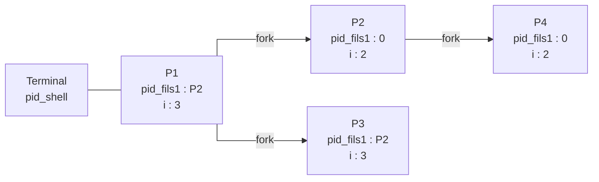
Sortie :
```
Je suis P3, et la valeur de i est : 3
Je suis P2, et la valeur de i est : 2
Je suis P4, et la valeur de i est : 2
Je suis P1, et la valeur de i est : 3

zsh(pid_shell)───complex1(P1)─┬─complex1(P2)───complex1(P4)
                              └─complex1(P3)
```
### Code complexe 2
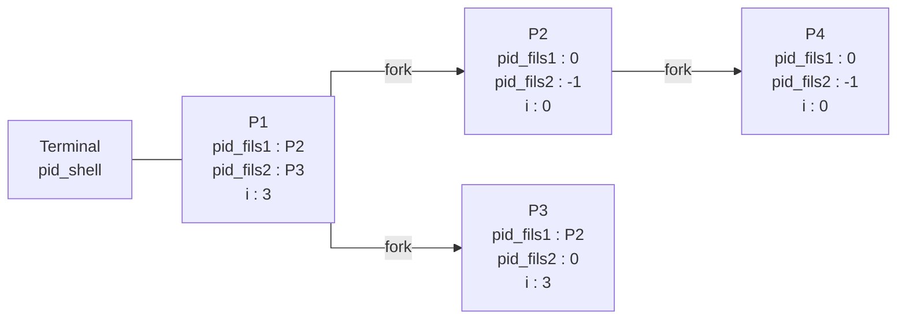
Sortie : 
```
Je suis P4
pid_fils1 : 0
pid_fils2 : -1
i : 0

Je suis P2
pid_fils1 : 0
pid_fils2 : -1
i : 0

Je suis P1
pid_fils1 : P2
pid_fils2 : P3
i : 3

Je suis P3
pid_fils1 : P2
pid_fils2 : 0
i : 3

zsh(pid_shell)───complex2(P1)─┬─complex2(P2)───complex2(P4)
                              └─complex2(P3)
```
## Exercice 11
1) Ce programme a pour effet de réaliser des fork à l'infini. En effet, à chaque nouveau ``fork()``, l'entier ``fork_return_value`` prend la valeur 0, la condition de sortie n'est donc jamais vérifiée, il s'agit donc d'une boucle infinie d'où le nom de fork bomb.
2) À partir d'un certain nombre de fork, les suivants vont échouer. Cela est du à une erreur système : on ne peux plus créer de nouveau processus et l'erreur renvoyée nous fait sortir de la bouche.
3) En rajoutant l'instruction 
   ```C
   sleep(1);
   ```
   entre chaque appel de fork, on a le temps d'observer l'effet du programme sur l'arbre des processus du système :
   ```
   zsh(41479)───bomb(104071)─┬─bomb(104072)
                             ├─bomb(104097)
                             ├─bomb(104109)
                             ├─bomb(104131)
                             ├─bomb(104133)
                             ├─bomb(104165)
                             ├─bomb(104166)
                             ├─bomb(104180)
                             ├─bomb(104206)
                             ├─bomb(104213)
                             ├─bomb(104214)
                             ├─bomb(104245)
                             ├─bomb(104246)
                             ├─bomb(104253)
                             ├─bomb(104278)
                             ├─bomb(104280)
                             ├─bomb(104286)
                             └─bomb(104294)
   ```