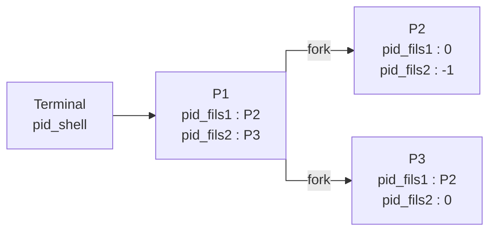
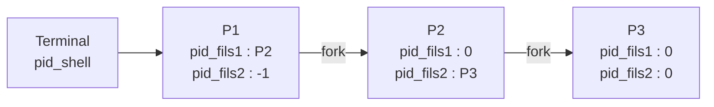
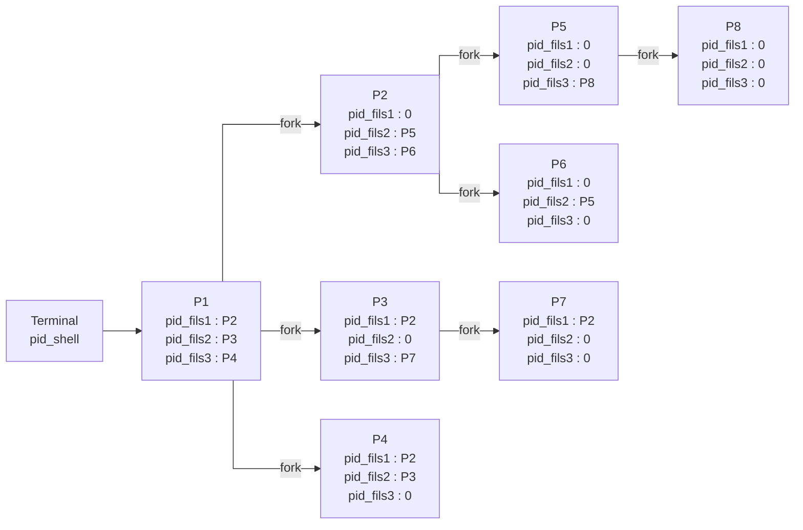

# Séances 3 et 4 : La terminaison de processus lourds, le recouvrement de code et duplication de processus avec pointeurs
### Exercice 1
1) Sortie du programme :
```
s4my at LAPTOP-C54OD56J in ~/ProgSys/TP_3-4
$ ./bin/wait_exit
que vous lirez peut-être si vous avez le temps

s4my at LAPTOP-C54OD56J in ~/ProgSys/TP_3-4
$ Monsieur le Président, je vous fais une lettre
```
2) On ajoute un appel à la primitive ``wait`` pour que le père attende la fin de l'exécution de son fils pour continuer la sienne.
3) 
   - **exit1** ne produit pas le même affichage : en effet, le fils et le père affichent tous deux la deuxième ligne.
   - **exit2** produit bine le même affichage : en effet, en appelant la procédure ``exit`` le fils finit bien son exécution avant d'afficher la deuxième ligne et le père attends la fin de l'exécution de son fils pour afficher cette dernière.
   - **exit3** ne produit pas le même affichage : en effet, l'appel à la procédure ``wait`` s'est fait après l'affichage de la deuxième ligne. Ainsi, le père affiche sa ligne avant d'attendre son fils.
### Exercice 2
 1) Le code affecté au fils correspond au code encapsulé dans le 
   ```C
   if(pid_fils == 0)
   ```
   le reste du code (dans le ``else``) est affecté au père.
 2) En toute logique, si la ressource processeur était équitablement répartie entre le père et le fils, le père, ayant moins d'itérations de boucle à réaliser, devrait finie en premier.
   
 3) Sortie du programme : 
```
s4my at LAPTOP-C54OD56J in ~/ProgSys/TP_3-4
$ ./bin/orphan
(père, 39410) ..
(fils, 39411) .. mon père est 39410
(fils, 39411) .. mon père est 39410
(père, 39410) ..
(fils, 39411) .. mon père est 39410
(père, 39410) ..
(fils, 39411) .. mon père est 39410
(père, 39410) ..
(père, 39410) ..
(fils, 39411) .. mon père est 39410
(père, 39410) J'ai terminé...
(fils, 39411) .. mon père est 39410

s4my at LAPTOP-C54OD56J in ~/ProgSys/TP_3-4
$ (fils, 39411) .. mon père est 356
(fils, 39411) .. mon père est 356
(fils, 39411) .. mon père est 356
(fils, 39411) .. mon père est 356
(fils, 39411) J'ai terminé
```
On constate que le texte affiché par le processus fils n'est pas toujours le même, cela s'explique par le fait qu'il affiche le PID de son père et vu que ce dernier termine son exécution avant lui, il est libéré de la table des PCB. 
### Exercice 3
Lorsque c'est le fils qui a finit son exécution et qui attend son père, il est en état de zombie.
### Exercice 4
Dans ce programme, on retrouve une boucle infinie qui duplique les processus à l'aide de ``fork``. Malgré l'appel de la procédure ``exit`` des fils, ces derniers attendent la fin de l'exécution de leur père. Ce sont donc des zombies qui s'accumulent jusqu'à ce que la table des PCB sature et ne permette plus la création d'un seul processus.
### Exercice 5
#### famille_wait1

Sortie :
```
Bonjour, je suis Léodagan (P1).
Bonjour, je suis Guenièvre (P2), mon père est P1.
Bonjour, je suis Yvain (P3), mon père est P1.

zsh(pid_shell)───famille_wait1(P1)─┬─famille_wait1(P2)
                                   └─famille_wait1(P3)
```
La génération d'orphelins n'est pas possible dans ce programme
#### famille_wait2

Sortie :
```
(pid:P1, ppid:pid_shell) Do you do you Saint-Tropez (P2) (-1)
(pid:P2, ppid:P1) Do you do you Saint-Tropez (0) (P3)
(pid:P3, ppid:P2) Do you do you Saint-Tropez (0) (0)

zsh(pid_shell)───famille_wait2(P1)───famille_wait2(P2)───famille_wait2(P3)
```
La génération d'orphelins est possible si P2 finit son exécution avant P3
#### famille_wait3

Sortie :
```
(pid:P1, ppid:pid_shell) Do you do you Saint-Tropez (-1) (-1)
(pid:P3, ppid:P2) Do you do you Saint-Tropez (0) (0)
(pid:P2, ppid:new_dad) Do you do you Saint-Tropez (0) (P3)

zsh(pid_shell)───famille_wait3(P1)───famille_wait3(P2)───famille_wait3(P3)
```
Il y a forcemment génération d'orphelins, en effet, P2 et P3 ne peuvent terminer qu'après la terminaison de P1 qui est leur ancêtre. De plus, P2 peut également terminer son exécution avant celle de P3.
#### famille_wait4

Sortie :
```
(pid : P1, ppid : pid_shell) Alors on danse (P2) (P3) (P4)
(pid : P4, ppid : P1) Alors on danse (P2) (P3) (0)
(pid : P3, ppid : P1) Alors on danse (P2) (0) (P7)
(pid : P7, ppid : P3) Alors on danse (P2) (0) (0)
(pid : P5, ppid : P2) Alors on danse (0) (0) (P8)
(pid : P2, ppid : P1) Alors on danse (0) (P5) (P6)
(pid : P6, ppid : P2) Alors on danse (0) (P5) (0)
(pid : P8, ppid : P5) Alors on danse (0) (0) (0)

zsh(pid_shell)───famille_wait4(P1)─┬─famille_wait4(P2)─┬─famille_wait4(P5)───famille_wait4(P8)
                                   │                   └─famille_wait4(P6)
                                   ├─famille_wait4(P3)───famille_wait4(P7)
                                   └─famille_wait4(P4)
```
La génération d'orphelins n'est pas possible dans ce programme.
### Exercice 6
#### Arbre 1
```C
#include <stdio.h>    /* stderr, stdout, fprintf, perror */
#include <unistd.h>   /* fork */
#include <sys/wait.h> /* wait */
#include <stdlib.h>   /* exit */

int main()
{
    pid_t pid_fils = -1;

    pid_fils = fork();

    for (int i = 0; i < 3; i++)
    {
        if (pid_fils == 0)
        {
            pid_fils = fork();
        }
    }
    wait(NULL);
    sleep(15);
    exit(EXIT_SUCCESS);
}
```
On obtient bien l'arbre suivant :
```
zsh(pid_shell)───arbre1(P1)───arbre1(P2)───arbre1(P3)───arbre1(P4)
```
#### Arbre 2
```C
#include <stdio.h>    /* stderr, stdout, fprintf, perror */
#include <unistd.h>   /* fork */
#include <sys/wait.h> /* wait */
#include <stdlib.h>   /* exit */

int main()
{
    pid_t pid_fils = -1;

    for (int i = 0; i < 4; i++)
    {
        if (pid_fils != 0)
        {
            pid_fils = fork();
        }
    }
    wait(NULL);
    sleep(15);
    exit(EXIT_SUCCESS);
}
```
On obtient bien l'arbre suivant :
```
zsh(pid_shell)───arbre2(P1)─┬─arbre2(P2)
                            ├─arbre2(P3)
                            ├─arbre2(P4)
                            └─arbre2(P5)
```
#### Arbre 3
```C
#include <stdio.h>    /* stderr, stdout, fprintf, perror */
#include <unistd.h>   /* fork */
#include <sys/wait.h> /* wait */
#include <stdlib.h>   /* exit */

int main()
{
    pid_t pid_fils1 = -1;
    pid_t pid_fils2 = -1;
    pid_t pid_fils3 = -1;

    pid_fils1 = fork();

    if (pid_fils1 == 0)
    {
        for (int i = 0; i < 2; i++)
        {
            if (pid_fils1 == 0)
            {
                pid_fils1 = fork();
            }
        }
    }
    else
    {
        pid_fils2 = fork();
        if (pid_fils2 != 0)
        {
            pid_fils3 = fork();
        }
        sleep(15);
        exit(EXIT_SUCCESS);
    }

    wait(NULL);
    sleep(15);
    exit(EXIT_SUCCESS);
}
```
On obtient bien l'arbre suivant :
```
zsh(pid_shell)───arbre3(P1)─┬─arbre3(P2)───arbre3(P3)───arbre3(P4)
                            ├─arbre3(P5)
                            └─arbre3(P6)
```
### Exercice 7
```C
#include <stdio.h>    /* stderr, stdout, fprintf, perror */
#include <unistd.h>   /* fork */
#include <sys/wait.h> /* wait */
#include <stdlib.h>   /* exit, atoi */
#include <time.h>

int main(int argc, char *argv[])
{
    pid_t pid_fils = -1;
    int temps_traitement_simule = (rand() % 10) + 1;
    int n = atoi(argv[1]);
    for (int i = 0; i < n; i++)
    {
        pid_fils = fork();
        if (pid_fils == 0)
        {
            sleep(temps_traitement_simule);
            exit(EXIT_SUCCESS);
        }
    }
    wait(NULL);
}
```
On fait une boucle pour qui crée, à chaque itération une nouveau fils qui termine son exécution pendant que le père attend bien la fin de celle de tous ces enfants.  

Sortie :
````
zsh(6026)───n_sons(11597)─┬─n_sons(11598)
                          ├─n_sons(11599)
                          ├─n_sons(11600)
                          ├─n_sons(11601)
                          ├─n_sons(11602)
                          ├─n_sons(11603)
                          ├─n_sons(11604)
                          ├─n_sons(11605)
                          ├─n_sons(11606)
                          ├─n_sons(11607)
                          ├─n_sons(11608)
                          ├─n_sons(11609)
                          ├─n_sons(11610)
                          ├─n_sons(11611)
                          ├─n_sons(11612)
                          ├─n_sons(11613)
                          ├─n_sons(11614)
                          ├─n_sons(11615)
                          ├─n_sons(11616)
                          └─n_sons(11617)
````
### Exercice 8
Revoir le cours sur la primitive ``wait``.