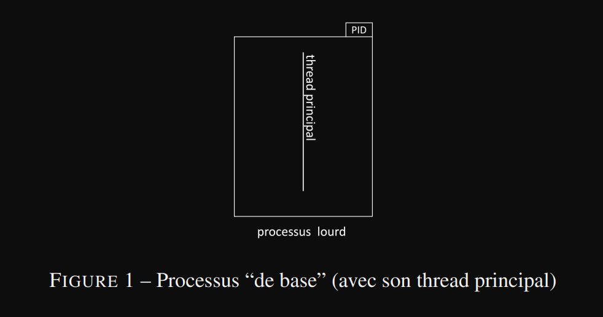

# Séance 9 : Les processus légers (Threads)
## Sommaire
- [x] [Exercice 1](#exercice-1)
- [ ] [Exercice 2](#exercice-2)
- [ ] [Exercice 3](#exercice-3)
- [ ] [Exercice 4](#exercice-4)
### Exercice 1 : Mise en oevre de multi-threading
1) on crée un programme d'affichages espacés d'une semconde à l'aide de la primitive ``sleep`` 
    ```C
    #include <colors.h>
    #include <prog_sys.h>
    #include <std.h>

    int main()
    {
        for (int i = 1; i <= 4; i++)
        {
            printf("Thread principal (%d/4) \n", i);
            sleep(1);
        }

        pthread_exit(EXIT_SUCCESS);
    }
    ```
2) L'exécution de ce code crée un processus ne comportant qu'un seul thread (le thread principal cf. figure 1)
   
3) En lisant la documentation, on comprend que l'appel à la primitive ``pthread_exit`` sur le dernier thread en cours d'exécution (dans notre cas le thread principal) revient à appeler la primitive ``exit(EXIT_SUCCESS)``. /!\ Attention /!\\, l'argument passé à la primitive ``pthread_exit`` ne permet pas de récupérer la valeur de retour du dernier thread en cours d'exécution. En effet, un appel à ``pthread_exit(EXIT_FAILURE)`` revient à un ``exit(EXIT_SUCESS)``.
4) On ajoute le thread ainsi que sa routine comme dans l'exemple du cours
   ```C
   void *routineThread(void *arg)
    {
        long num = (long)arg;
        for (int i = 1; i <= 6; i++)
        {
            printf("Thread numero : %ld (%d/6) \n", num, i);
            sleep(1);
        }
        return (void *)EXIT_SUCCESS;
    }
   ```
   ```C
   pthread_t thr1;
    int returnValue = pthread_create(&thr1, NULL, routineThread, (void *)1);

    if (returnValue != 0)
    {
        fprintf(stderr, "Erreur pthread_create premier thread\n");
    }
   ```
5) De la même manière, on crée les deux autres threads qui vont utiliser la même routine et on observe en sortie :
   ```
   $ bin/multiThread
    Thread numero : 1 (1/6)
    Thread numero : 2 (1/6)
    Thread numero : 3 (1/6)
    =======================
    Thread principal (1/4)
    =======================
    Thread numero : 3 (2/6)
    =======================
    Thread principal (2/4)
    =======================
    Thread numero : 2 (2/6)
    Thread numero : 1 (2/6)
    Thread numero : 3 (3/6)
    =======================
    Thread principal (3/4)
    =======================
    Thread numero : 2 (3/6)
    Thread numero : 1 (3/6)
    Thread numero : 3 (4/6)
    =======================
    Thread principal (4/4)
    =======================
    Thread numero : 2 (4/6)
    Thread numero : 1 (4/6)
    Thread numero : 3 (5/6)
    Thread numero : 2 (5/6)
    Thread numero : 1 (5/6)
    Thread numero : 3 (6/6)
    Thread numero : 2 (6/6)
    Thread numero : 1 (6/6)
   ```
6) Cf. question 4.
### Exercice 2